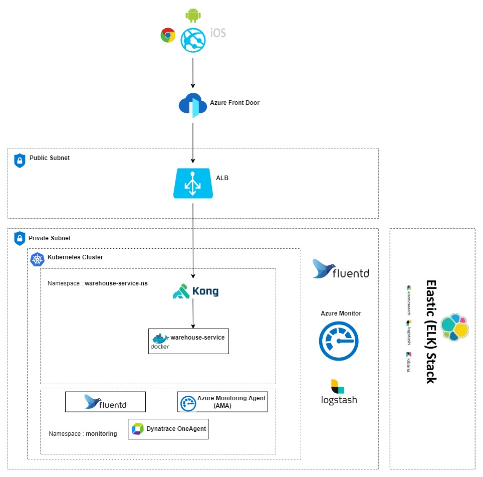

# Warehouse API

Micro Services to display the Warehouse API . This Warehouse API allows users to manage products and boxes and 
search products. Operation available in Warehouse API are create box , create products , search products and create box.

## Technologies Requirements

* [Java17](https://www.oracle.com/java/)
* [Maven](https://maven.apache.org/)
* [Spring Boot](https://spring.io/projects/spring-boot)
* [H2 Database](https://www.h2database.com/html/main.html)
* [jUnit](https://junit.org/)
* [mockito](https://site.mockito.org/)
* [Docker](https://www.docker.com/)
* [resilience4j](https://resilience4j.readme.io/docs)
* [Spring Cloud Sleuth](https://spring.io/projects/spring-cloud-sleuth)
* [Open API 3.0.1](https://spec.openapis.org/oas/v3.0.1)
* [JaCoCo](https://www.eclemma.org/jacoco/)


## Application Envision Architecture



## How to run the application

## Running the application using docker

### Installation

Use the maven command line interface [Maven](https://maven.apache.org/) to install the dependencies

```bash
mvn install -DSkipTests
```

### Test
Use the maven command line interface [Maven](https://maven.apache.org/) to perform unit test
```bash
mvn test
```
### package build
```bash
mvn package
```
### Docker build
```bash
 docker build --rm -f "Dockerfile" -t warehouse-service:latest "."
```

### How the docker image is build
* Base image for the docker container is `openjdk:17-oracle`

* Compiled class files under `target/warehouse-service-1.0.1.0-SNAPSHOT.jar  ` are copied to `webapp.jar` in the image

### How to run docker container

```bash
docker container run  -p 9091:9091 -d  -e "SPRING_PROFILES_ACTIVE=production" --rm --name warehouse-service warehouse-service:latest
```
## How to run the application in Kubernetics

* push the created image to Docker container registry using push command
  `docker tag 092f82fa7ed7 noblesebastiank/warehouse-service:latest`
  `docker push noblesebastiank/warehouse-service:latest`
* connect to cloud kubernetes cluster
* Deploy the image to kubernetics pod using apply command
  ` kubectl apply -f deployment.yaml`
* Check the status of the pod
  ` Kubectl get pods`
* Test the application

## How to run the application in Azure Cloud

* Create build pipe line using mvn template or default template
* Define stages for using mvn template, add stages like test,pakage,build image,push image to docker container registry
* Create release piple line in cloud and deploy the deployment.yaml
  ` kubectl apply -f deployment.yaml`
* Check the status of the pod
  ` Kubectl get pods`
* Test the application

## Running the application with IDE

There are several ways to run a Spring Boot application on your local machine. One way is to execute the `main` 
method in the `com.mycompany.warehouse.WarehouseApplication` class from your IDE.

* 	Download the zip or clone the Git repository.
* 	Unzip the zip file (if you downloaded one)
* 	Open Command Prompt and Change directory (cd) to folder containing pom.xml
* 	Open Eclipse
    * File -> Import -> Existing Maven Project -> Navigate to the folder where you unzipped the zip
    * Select the project
* 	Open Intleji
    * File->Open -> Navigate to the folder where you unzipped the zip
    * Select the project
* 	Choose the Spring Boot Application file (search for @SpringBootApplication)
* 	Right Click on the file and Run as Java Application
* 	Use the profile as development


## Health Check

+
    - path : /warehouse-service/health
    - port : 9091

## Docker image
-  https://hub.docker.com/repository/docker/noblesebastiank/warehouse-service

## Data Contract

+
    - path : warehouse-service-open-api.yaml
    - open [swaggerEditor](https://editor.swagger.io)  then paste the contents in openapi.yaml

## Swagger URL
-  http://localhost:9091/swagger-ui/index.html

## API collection
- got to directory ./postman-collection. Here you can see the postman collection


## Test Coverage
- More than 90 % Test coverage for all classes other than classes under package model and dtos, it can be viewed
  using Jacoco

## Relevance of technologies used
- Java17 - Latest LTS java version 
- Spring boot- One of the fine way to create microservices using Java
- H2 database- Easy to use the h2 database in assignments
- Junit- One of the best testing framework
- Docker- Build, share, and run Any application anywhere
- resilience4j- It is a lightweight, easy-to-use fault tolerance library
- Spring Cloud Sleuth- Provides Spring Boot auto-configuration for distributed tracing
- Open API- Best way to share contract
- JaCoCo- JaCoCo is a free code coverage library for Java
